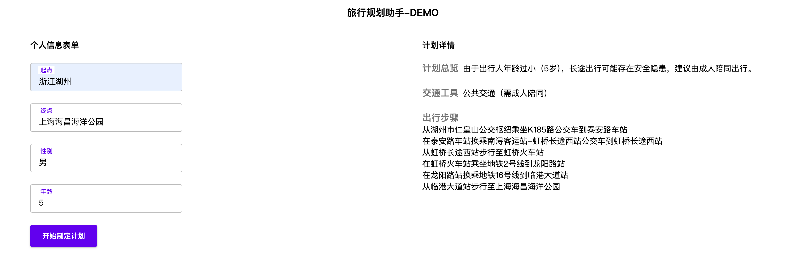
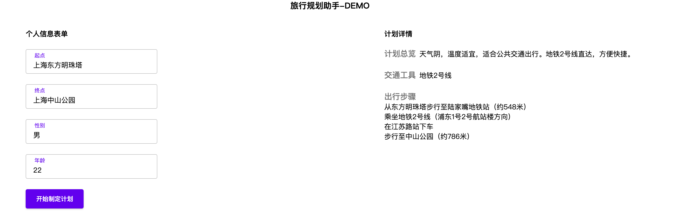
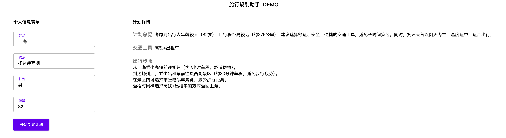

# 🚗  AI Travel Planner · 智能出行规划助手  - DEMO
**基于 DeepSeek 的个性化旅行规划工具** · 根据用户画像（年龄、性别）、起止点与天气，生成安全合理的独自出行计划。 

### 一、项目概述
轻量级 AI Agent 系统 DEMO，通过分析用户画像（年龄、性别）、出发地与目的地，结合 **DeepSeek 大模型**的推理能力与 **高德地图 API** 的地理数据，动态生成个性化独自出行计划。

系统优化逻辑：  
- **用户画像适配**：为不同群体推荐适宜活动,如小朋友和老人不推荐独自远行,年轻人在距离比较近的时候可能会推荐不行等等特性
- **实时天气融合**：智能考量两个地点的天气情况,避开恶劣天气出行。
- **高德地图支持**：大模型智能调用高德地图mcp, 提供精确路线、距离与交通耗时数据。
---

### 二、核心功能
| 模块                | 说明                                                                 |
|---------------------|----------------------------------------------------------------------|
| **用户画像分析**    | 解析年龄/性别，动态调整行程强度与活动类型                        |
| **多因素行程规划**  | 融合距离、天气、交通方式生成合理路线                    |
| **高德地图集成**    | 调用地理编码、路径规划、POI 搜索接口                          |
| **DeepSeek 调度**   | 使用 DeepSeek-R1 模型生成自然语言计划                      |
| **安全校验机制**    | 规避深夜偏僻路线，优先推荐安全区域                              |

---
### 二、功能截图

