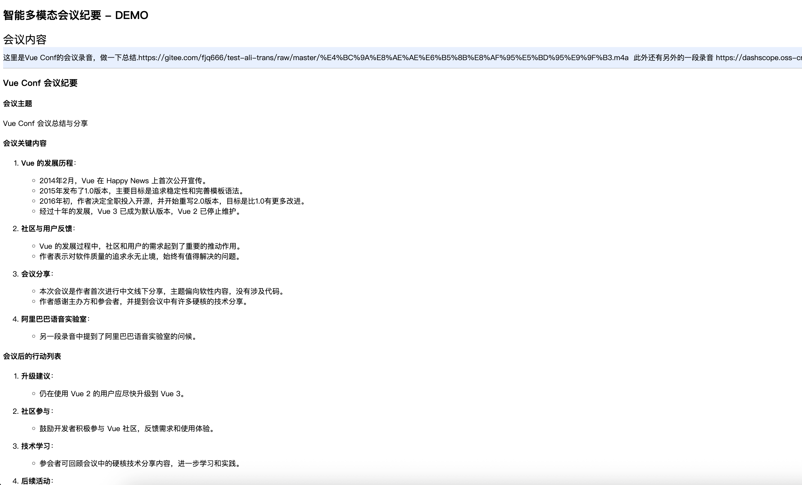

# 🎙️ 多模态智能会议纪要 - Demo
**基于Paraformer-v2语音识别与大模型的智能会议纪要系统**  

## 项目亮点

大模型无法直接根据录音文件生成会议纪要, 项目以Paraformer-v2为外部MCP资源供给大模型在合适的时候调用生成文字版会议纪要,综合会议纪要的文字部分综合生成会议纪要

## 关键词

* Paraformer-v2语音识别
* Deepseek LLM 综合分析
* MCP
* 支持同时支持文字和语音

## 截图
