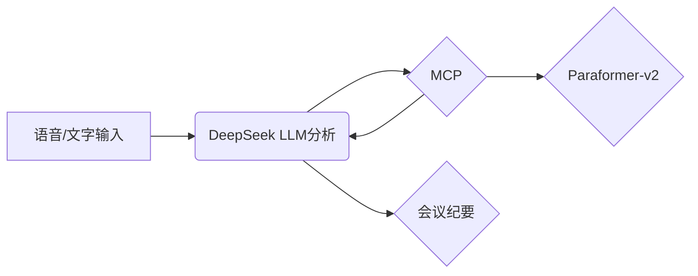

# 🎙️ 多模态智能会议纪要系统  
**基于 Paraformer-v2 语音识别与 DeepSeek LLM 的智能会议纪要生成引擎**  

---

## ⚡️ 核心创新  
通过 **Paraformer-v2 语音识别引擎**（阿里云百炼）与 **DeepSeek LLM** 的协同架构，实现：
- ✅ **语音→文本→结构化纪要** 全链路自动化  
- ✅ LLM智能调用 MCP 中间件解析音频文件,而非预先结构化数据预处理音频文件  
- ✅ 多模态输入融合（语音+文字）生成专业会议纪要

> 让User端更加自由地组织文字内容和音频内容,而无语预先结构化预处理音频文件

---

## 🛠️ 技术架构  

## 截图
