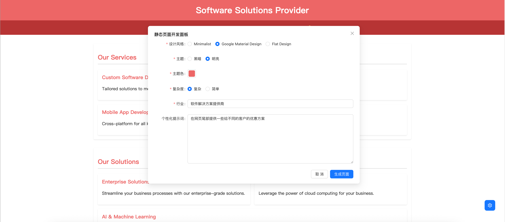

# 🚀 AI Web Agent - 静态页定制平台

> **通过多维度描述生成HTML页面 · 集成文件系统映射 · 支持可视化精准调试**

## 🌟 核心亮点
1. **多维度描述生成HTML**  
   - 支持自然语言、结构化参数、设计草图等多模态输入
   - 基于LLM推理生成符合W3C标准的静态网页
   - 动态解析CSS/CSS依赖关系，自动完成样式定制和拆分
2. **基本技术架构**  
   ```mermaid
   graph LR
   A[用户描述] --> B(LLM推理引擎)
   B --> C{MCP文件系统}
   C --> D[文件系统]
   D --> E[http静态服务器]
   F[用户] --> E
   ```

## 🌟 截图展示
