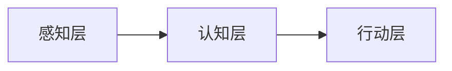

# Insigh Report ：非预定义数据价值探索 Demo

## 一、项目背景
传统报表系统依赖业务部门**预定义数据切面**（如财务/生产指标），再传达需求给信息部,导致：
- **认知局限**：仅验证已知假设，无法发现隐藏关联
- **信息丢失**: 需求传递过程中导致的最终报表和原始需求不一致
- **响应滞后**：新增分析需求需重新开发，错过决策窗口期  
本 Demo 探索通过 **AI Agent 自主发现非预定义数据价值**，让业务部门可以通过对话方式查询报表, 甚至发现数据中潜在的一些问题。

## 二、Demo 核心设计
### 轻量级三层架构
